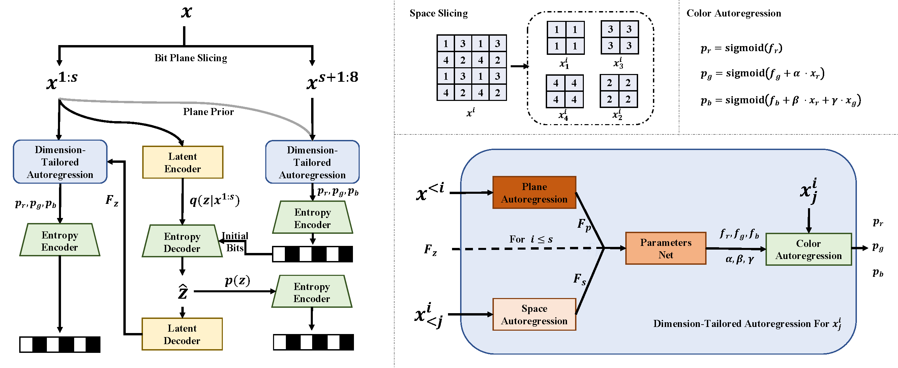

# ArIB-BPS

### <p align="center"> Learned Lossless Image Compression based on Bit Plane Slicing</p>
####  <p align="center"> CVPR 2024</p>
####  <p align="center"> Zhe Zhang, Huairui Wang, Zhenzhong Chen, Shan Liu</p>



## Environments
```
conda env create -f arib_bps.yml
```

## Entropy Coder Compiling
```
cd src/utils/coder
g++ -O3 -Wall -shared -std=c++11 -fPIC `python -m pybind11 --includes` python_interface.cpp -o mixcoder.so
```

## Folder Structure
Model weights are stored in a folder containing "sig.pth", which is the model for significant planes and "ins.pth", which is the model for insignificant planes. Each model has a corresponding configuration file, refer to src/config folder.

We use three kinds of folder structures for dataset:
- CIFAR10 dataset (torchvision.datasets.CIFAR10), where images should be download using argument --download=True.
- ImageFolder dataset (torchvision.datasets.ImageFolder), where images are stored in subfolders of the dataset root.
- FileDataset (utils.dataset.FileDataset), where images are stored in the dataset root.

## Encoding and Decoding
```
python compress.py (--encode | --decode) --input [path to input file] --output [path to output file] --config [path to config file] --model [path to model folder]
```

## Testing
```
python test.py --dataset [cifar10|imagenet32|imagenet64|imagenet64_small] --dataset_type [cifar10|imagefolder|filedataset] --data_dir [path to dataset folder] --model [path to model folder] --mode [inference|single|dataset|speed] <--batchsize> [batch size for inference, or size of dataset for dataset compression setting] <--log_path> [logger path for dataset/single compression setting]
```

- Inference mode: evaluate the thereotical compression performance.
- Single mode: evaluate the single-image compression performance.
- Dataset mode: evaluate the dataset compression performance.
- Speed mode: evaluate the inference speed of the model.

## Training
Models for significant planes and insignificant planes are trained separately. 

```
python train.py --num_gpus [number of gpus] --mode [sig|ins|finetune] --dataset_type [cifar10|imagefolder|filedataset] --data_dir [path to dataset folder] --valid_num [size of validation set] --config [path to config file] --dropout [probability of dropout] --save_dir [path to save log and weights] --lr [learning rate] --batch_size [batch size for each gpu] --num_iters [number of iterations] --log_interval [interval of logging] --valid_interval [interval of validation] --decay_rate [decay rate of learning rate] --decay_interval [interval of decaying learning rate] <--resume> [path to pretrained checkpoints] <--qp_path> [relative path to qplist, only used for finetune mode] <--master_port> [master port for ddp]
```

- Sig mode: train the model for significant planes.
- Ins mode: train the model for insignificant planes.
- Finetune mode: finetune the model for significant planes using discretized sampling. To use this mode, a pretrained model for both significant and insignificant planes should be provided, and a dataset with qplist should be provided, which could be generated using
```
python generate_finetune_dataset.py --dataset_type [cifar10|filedataset] --data_dir [path to dataset folder] --model [path to model folder] --config [path to config file] <--data_dst> [path to folder of qp list and imgs, only required for cifar10 dataset]  <--qp_path> [relative path to qplist]
``` 

## Pretrained Models
Pretrained models are available [here](https://drive.google.com/drive/folders/1RiI2Fzqu0lhjHSpjrOVPb0eOzvnJD9XC?usp=sharing). Related configuration files are available in src/config folder.

## Training Settings
We list the training settings for the models in the following table.
- lr: learning rate.
- bs: total batch size, which equals to the batch size for each gpu times the number of gpus.
- ni: number of iterations.
- vi: interval of validation.
- dr: decay rate of learning rate.
- di: interval of decaying learning rate.
- drop: probability of dropout.
- vs: size of validation set.
- IN: ImageNet.

| model | mode | lr | bs |ni|vi|dr|di|drop|vs|
| ------- | ------- | ------- | ------- | ------- | ------- |------- | ------- | ------- |------- |
| Cifar10 | sig | 2e-4 | 16 | 7.4e5 |2.8e3 | 0.99 | 2.8e3 |0.3 |5000|
| Cifar10 | ins | 2e-4 | 16 | 7.4e5 |2.8e3 | 0.99 | 2.8e3 |0.3 |5000|
| Cifar10 | finetune | 1e-5 | 16 | 5.6e4 |2.8e3 | 1 | 2.8e3 |0.3 |5000|
| IN32 | sig | 2e-4 | 128 | 7e5 |1e4 | 0.965 | 1e4 |0.2 |50000|
| IN32 | ins | 2e-4 | 128 | 7e5 |1e4 | 0.965 | 1e4 |0.2 |50000|
| IN32 | finetune | 1e-5 | 16 | 1e5 |1e4 | 1 | 1e4 |0.0 |50000|
| IN64 | sig | 2e-4 | 128 | 6e5 |1e4 | 0.965 | 1e4 |0.0 |50000|
| IN64 | ins | 2e-4 | 128 | 6e5 |1e4 | 0.965 | 1e4 |0.0 |50000|
| IN64 | finetune | 1e-5 | 16 | 1e5 |1e4 | 1 | 1e4 |0.0 |50000|
| IN64(small) | sig | 2e-4 | 128 | 7.4e5 |2.8e3 | 0.99 | 2.8e3 |0.0 |50000|
| IN64(small) | ins | 2e-4 | 128 | 7.4e5 |2.8e3 | 0.99 | 2.8e3 |0.0 |50000|
| IN64(small) | finetune | 1e-5 | 16 | 1.3e5 |2.8e3 | 1 | 2.8e3 |0.0 |50000|

## Note
There are two versions of ImageNet32 and ImageNet64 datasets. We use the old version to compare with existing methods. The old version is avaible here

[ImageNet32](https://academictorrents.com/details/bf62f5051ef878b9c357e6221e879629a9b4b172) [ImageNet64](https://academictorrents.com/details/96816a530ee002254d29bf7a61c0c158d3dedc3b)

## Citation

```
@InProceedings{zhang2024learned,
    author    = {Zhang, Zhe and Wang, Huairui and Chen, Zhenzhong and Liu, Shan},
    title     = {Learned Lossless Image Compression based on Bit Plane Slicing},
    booktitle = {Proceedings of the IEEE/CVF Conference on Computer Vision and Pattern Recognition (CVPR)},
    month     = {June},
    year      = {2024},
    pages     = {27579-27588}
}
